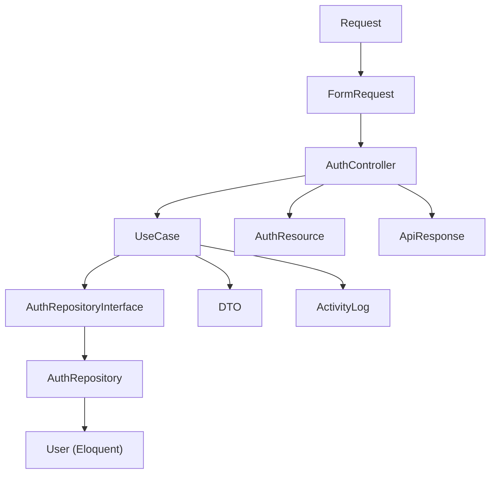

# Full Auth Module Plan

## Current State

| Item | Status |
|---|---|
| `User` model | Exists — JWT-ready, `BelongsToTenant`, `HasUuid` |
| Migration (`users`, `branches`, `password_resets`, `user_branches`) | Exists |
| `config/auth.php` (`api` + `platform` JWT guards) | Exists — 1 fix needed |
| `AuthServiceProvider`, `RouteServiceProvider`, `RepositoryServiceProvider` | Exists — stub only |
| `Presentation/Routes/api.php` | Exists — empty |
| Application/Domain/Persistence layers | **Missing entirely** |

## Fixes Required First

- **`config/auth.php`** — change `password_reset_tokens` → `password_resets` (matches actual migration table)
- **`RepositoryServiceProvider.php`** — add `$this->app->bind(AuthRepositoryInterface::class, AuthRepository::class)` in `register()`
- **`bootstrap/app.php`** — register middleware aliases `scope.tenant` and `SetLocale` and add `auth:api` / `auth:platform` guard aliases
- **`Presentation/Routes/api.php`** — update prefix from `auth` → `v1/auth` and add all route definitions

## Architecture



## Route Map

Per `CURSOR_RULES.md` section 4 + 10:

**Tenant Auth** — `POST /api/v1/auth/*` (no `scope.tenant`, guard `api` on protected routes)
- `POST /api/v1/auth/login`
- `POST /api/v1/auth/register`
- `POST /api/v1/auth/logout` — `[auth:api]`
- `POST /api/v1/auth/refresh` — `[auth:api]`
- `POST /api/v1/auth/forgot-password`
- `POST /api/v1/auth/reset-password`
- `GET  /api/v1/auth/me` — `[auth:api]`

**Platform Admin** — `POST /api/v1/central/auth/*` (guard `platform`)
- `POST /api/v1/central/auth/login`
- `POST /api/v1/central/auth/logout` — `[auth:platform]`
- `POST /api/v1/central/auth/refresh` — `[auth:platform]`
- `GET  /api/v1/central/auth/me` — `[auth:platform]`

## Files to Create

### Domain Layer
- [`app/Modules/Auth/Domain/Interfaces/AuthRepositoryInterface.php`](app/Modules/Auth/Domain/Interfaces/AuthRepositoryInterface.php) — contract for `findByEmailForTenant()`, `findByEmailForPlatform()`, `createPasswordReset()`, `findPasswordReset()`, `deletePasswordReset()`

### Application Layer — DTOs (`readonly` classes)
- [`app/Modules/Auth/Application/DTOs/LoginDTO.php`](app/Modules/Auth/Application/DTOs/LoginDTO.php) — `email`, `password`, `guard`
- [`app/Modules/Auth/Application/DTOs/RegisterDTO.php`](app/Modules/Auth/Application/DTOs/RegisterDTO.php) — `tenant_id`, `name`, `username`, `email`, `phone`, `password`
- [`app/Modules/Auth/Application/DTOs/ForgotPasswordDTO.php`](app/Modules/Auth/Application/DTOs/ForgotPasswordDTO.php) — `email`, `tenant_id`
- [`app/Modules/Auth/Application/DTOs/ResetPasswordDTO.php`](app/Modules/Auth/Application/DTOs/ResetPasswordDTO.php) — `token`, `email`, `password`, `tenant_id`

### Application Layer — Use Cases
- [`app/Modules/Auth/Application/UseCases/LoginUseCase.php`](app/Modules/Auth/Application/UseCases/LoginUseCase.php) — validates credentials, checks `is_active`, issues JWT via `auth(guard)->attempt()`, updates `last_login_at`, logs `auth.login`
- [`app/Modules/Auth/Application/UseCases/RegisterUseCase.php`](app/Modules/Auth/Application/UseCases/RegisterUseCase.php) — creates user in `DB::transaction`, hashes password, issues token, logs `auth.registered`
- [`app/Modules/Auth/Application/UseCases/LogoutUseCase.php`](app/Modules/Auth/Application/UseCases/LogoutUseCase.php) — calls `auth(guard)->logout()`, invalidates + forgets token
- [`app/Modules/Auth/Application/UseCases/RefreshTokenUseCase.php`](app/Modules/Auth/Application/UseCases/RefreshTokenUseCase.php) — calls `auth(guard)->refresh()`
- [`app/Modules/Auth/Application/UseCases/ForgotPasswordUseCase.php`](app/Modules/Auth/Application/UseCases/ForgotPasswordUseCase.php) — generates token, writes to `password_resets`, dispatches `PasswordResetNotification`
- [`app/Modules/Auth/Application/UseCases/ResetPasswordUseCase.php`](app/Modules/Auth/Application/UseCases/ResetPasswordUseCase.php) — validates token/expiry from `password_resets`, updates user password, deletes reset record

### Application Layer — Exceptions
- [`app/Modules/Auth/Application/Exceptions/InvalidCredentialsException.php`](app/Modules/Auth/Application/Exceptions/InvalidCredentialsException.php)
- [`app/Modules/Auth/Application/Exceptions/UserInactiveException.php`](app/Modules/Auth/Application/Exceptions/UserInactiveException.php)
- [`app/Modules/Auth/Application/Exceptions/TokenExpiredException.php`](app/Modules/Auth/Application/Exceptions/TokenExpiredException.php)
- [`app/Modules/Auth/Application/Exceptions/InvalidResetTokenException.php`](app/Modules/Auth/Application/Exceptions/InvalidResetTokenException.php)

### Infrastructure Layer
- [`app/Modules/Auth/Infrastructure/Persistence/Repositories/AuthRepository.php`](app/Modules/Auth/Infrastructure/Persistence/Repositories/AuthRepository.php) — Eloquent implementation; uses `withoutGlobalScope(TenantScope::class)` when querying platform users (`tenant_id IS NULL`)
- [`app/Modules/Auth/Infrastructure/Notifications/PasswordResetNotification.php`](app/Modules/Auth/Infrastructure/Notifications/PasswordResetNotification.php) — mail notification with reset link

### Presentation Layer
- [`app/Modules/Auth/Presentation/Http/Controllers/AuthController.php`](app/Modules/Auth/Presentation/Http/Controllers/AuthController.php) — thin; calls use cases, returns `ApiResponse`
- [`app/Modules/Auth/Presentation/Http/Requests/LoginRequest.php`](app/Modules/Auth/Presentation/Http/Requests/LoginRequest.php)
- [`app/Modules/Auth/Presentation/Http/Requests/RegisterRequest.php`](app/Modules/Auth/Presentation/Http/Requests/RegisterRequest.php)
- [`app/Modules/Auth/Presentation/Http/Requests/ForgotPasswordRequest.php`](app/Modules/Auth/Presentation/Http/Requests/ForgotPasswordRequest.php)
- [`app/Modules/Auth/Presentation/Http/Requests/ResetPasswordRequest.php`](app/Modules/Auth/Presentation/Http/Requests/ResetPasswordRequest.php)
- [`app/Modules/Auth/Presentation/Resources/AuthUserResource.php`](app/Modules/Auth/Presentation/Resources/AuthUserResource.php) — maps `user_id` → `id`, hides `tenant_id`/`password`
- [`app/Modules/Auth/Presentation/Resources/Lang/en/auth.php`](app/Modules/Auth/Presentation/Resources/Lang/en/auth.php)
- [`app/Modules/Auth/Presentation/Resources/Lang/ar/auth.php`](app/Modules/Auth/Presentation/Resources/Lang/ar/auth.php)
- **Update** [`app/Modules/Auth/Presentation/Routes/api.php`](app/Modules/Auth/Presentation/Routes/api.php) — all tenant auth routes
- **Create** `app/Modules/Auth/Presentation/Routes/central.php` — platform admin routes (loaded by same `RouteServiceProvider`)

### API Documentation
- **Update** [`docs/RAKEEZA_ERP_API_DOCUMENTATION.json`](docs/RAKEEZA_ERP_API_DOCUMENTATION.json) — populate auth endpoint docs

## Key Implementation Details

**Platform vs Tenant login separation:**
- Tenant login: `LoginDTO` passes `guard = 'api'`; repository scopes by `tenant_id`
- Platform login: `LoginDTO` passes `guard = 'platform'`; repository uses `withoutTenantScope()` + `whereNull('tenant_id')`
- `User::getJWTCustomClaims()` already handles this — injects `guard: 'platform'` or `tenant_id` into token

**Password Reset table:**
- Uses custom `password_resets` table (not Laravel's default broker) — `password_reset_id` (UUID), `tenant_id` (nullable), `email`, `token` (hashed), `expires_at` (60 min)

**`User` model — add `password` hashed cast:**
```php
'password' => 'hashed',
```

**`AuthResource` shape:**
```json
{
  "id": "uuid",
  "name": "...",
  "username": "...",
  "email": "...",
  "phone": "...",
  "avatar": null,
  "is_active": true,
  "last_login_at": "...",
  "token": "...",
  "token_type": "bearer",
  "expires_in": 3600
}
```

**`RouteServiceProvider`** — load both `api.php` and `central.php`

**`AuthServiceProvider`** — load translations from `Presentation/Resources/Lang`

## Files to Modify

- [`app/Modules/Auth/Infrastructure/Providers/RepositoryServiceProvider.php`](app/Modules/Auth/Infrastructure/Providers/RepositoryServiceProvider.php) — add binding
- [`app/Modules/Auth/Infrastructure/Providers/RouteServiceProvider.php`](app/Modules/Auth/Infrastructure/Providers/RouteServiceProvider.php) — load central routes
- [`app/Modules/Auth/Infrastructure/Providers/AuthServiceProvider.php`](app/Modules/Auth/Infrastructure/Providers/AuthServiceProvider.php) — register translations
- [`app/Modules/Auth/Infrastructure/Database/Models/User.php`](app/Modules/Auth/Infrastructure/Database/Models/User.php) — add `password` hashed cast + `SoftDeletes`
- [`config/auth.php`](config/auth.php) — fix password broker table
- [`bootstrap/app.php`](bootstrap/app.php) — register middleware aliases (`scope.tenant`, `SetLocale`)
- [`docs/RAKEEZA_ERP_API_DOCUMENTATION.json`](docs/RAKEEZA_ERP_API_DOCUMENTATION.json) — populate auth section
