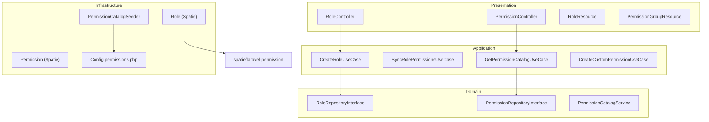

# Roles & Permissions Management with UX Labels

## Goal

Deliver tenant-scoped **Roles CRUD**, **permission catalog + custom permissions**, and **role-permission assignment** where the API always exposes human-readable bilingual labels for the UI — never raw keys alone.

| Internal (authorization) | UI label (EN) | UI label (AR) |
|---|---|---|
| `user.view` | View Users | عرض المستخدمين |
| `user.create` | Create Users | إنشاء مستخدم |
| `role.update` | Update Roles | تعديل الأدوار |

Keys stay in `name` (Spatie check: `$user->can('user.view')`). Labels live in dedicated columns and are returned grouped by module for checkbox/matrix UIs.

## Current State

- [`app/Modules/Roles/`](app/Modules/Roles/) — scaffold only (empty routes, no models/use cases)
- [`config/permission.php`](config/permission.php) — Spatie published, expects `model_has_roles` / `role_has_permissions` pivots
- [`app/Modules/Roles/.../create_roles_module_tables.php`](app/Modules/Roles/Infrastructure/Database/Migrations/2026_05_23_000000_create_roles_module_tables.php) — **outdated**: no labels, wrong pivot table names
- [`rakeeza-v5.sql`](rakeeza-v5.sql) — target schema with `display_name_en/ar`, `module`, `is_system`, Spatie morph pivots
- [`app/Modules/Auth/.../User.php`](app/Modules/Auth/Infrastructure/Database/Models/User.php) — exists, no `HasRoles` trait yet

## Architecture



## Step 1 — Fix Schema (align with rakeeza-v5.sql)

**Replace** the current Roles migration with:

### `roles`
- `role_id` (PK), `tenant_id`, `name` (slug/key e.g. `manager`), `guard_name`
- `name_en`, `name_ar` — role title shown in UI
- `display_name_en`, `display_name_ar` — optional subtitle
- `description_en`, `description_ar`
- `is_system` (boolean), `is_active`, timestamps, soft deletes

### `permissions`
- `permission_id` (PK), `tenant_id` (nullable UUID; `NULL` = global catalog row)
- `name` — Spatie key e.g. `user.view` (unique per tenant scope + guard)
- `guard_name`, `module` (e.g. `users`, `sales`, `inventory`)
- `label_en`, `label_ar` — **primary UX labels** (replaces exposing raw keys)
- `description_en`, `description_ar`
- `is_system` (catalog permissions cannot be deleted)
- timestamps

### Spatie pivots (update [`config/permission.php`](config/permission.php) — already correct names)
- `role_has_permissions` — `role_id`, `permission_id`, `tenant_id`
- `model_has_roles` — morph `model_id`/`model_type`, `role_id`, `tenant_id`
- `model_has_permissions` — morph, `permission_id`, `tenant_id`

Drop old tables: `role_user`, `permission_role`, `permission_user`.

## Step 2 — Custom Spatie Models

Create in [`app/Modules/Roles/Infrastructure/Database/Models/`](app/Modules/Roles/Infrastructure/Database/Models/):

- **`Role.php`** — extends `Spatie\Permission\Models\Role`, uses `HasUuid`, `BelongsToTenant`, `SoftDeletes`; PK `role_id`; maps Spatie `name` to slug key
- **`Permission.php`** — extends Spatie Permission model, uses `HasUuid`; PK `permission_id`; global scope: tenant sees catalog (`tenant_id IS NULL`) + own custom rows

Update [`config/permission.php`](config/permission.php):
```php
'models' => [
    'permission' => App\Modules\Roles\Infrastructure\Database\Models\Permission::class,
    'role'       => App\Modules\Roles\Infrastructure\Database\Models\Role::class,
],
```

Add `HasRoles` to [`User.php`](app/Modules/Auth/Infrastructure/Database/Models/User.php):
```php
use Spatie\Permission\Traits\HasRoles;
// guard_name = 'api' for tenant users
```

## Step 3 — Permission Catalog (labels source of truth)

Create [`app/Modules/Roles/Infrastructure/Config/permissions.php`](app/Modules/Roles/Infrastructure/Config/permissions.php) — structured catalog:

```php
return [
    'users' => [
        'label_en' => 'Users',
        'label_ar' => 'المستخدمون',
        'permissions' => [
            'user.view'   => ['label_en' => 'View Users',   'label_ar' => 'عرض المستخدمين'],
            'user.create' => ['label_en' => 'Create Users', 'label_ar' => 'إنشاء مستخدم'],
            // ...
        ],
    ],
    'roles' => [ /* role.view, role.create, role.update, role.delete, permission.assign */ ],
    'contacts' => [ /* contact.view, contact.create, ... per CURSOR_RULES §11 */ ],
    // modules: products, inventory, sales, purchasing, finance, payments, expenses, hr, reports, settings, pos
];
```

**Naming:** follow [`CURSOR_RULES.md`](rakeeza-rules/CURSOR_RULES.md) §11 — `{resource}.{action}` singular resource, actions: `view`, `create`, `update`, `delete`, plus module-specific (`inventory.adjust`, `pos.access`).

**Seeder:** `PermissionCatalogSeeder` reads config, upserts global rows (`tenant_id = NULL`, `is_system = true`) with all labels + module.

**Tenant provisioning:** copy/sync catalog permissions into tenant scope OR query catalog + tenant custom in repository (recommended: single query `WHERE tenant_id IS NULL OR tenant_id = :tenant`).

## Step 4 — Application Layer

### Domain
- `RoleRepositoryInterface` — CRUD, syncPermissions, assignToUser
- `PermissionRepositoryInterface` — listGrouped, createCustom, findByKey

### Domain Service
- `PermissionCatalogService` — merges config + DB; resolves locale label via `app()->getLocale()`

### DTOs
- `CreateRoleDTO`, `UpdateRoleDTO`, `SyncRolePermissionsDTO`, `CreateCustomPermissionDTO`

### Use Cases
| Use Case | Responsibility |
|---|---|
| `CreateRoleUseCase` | Create role with bilingual names; log activity |
| `UpdateRoleUseCase` | Update role; block if `is_system` name change |
| `DeleteRoleUseCase` | Soft delete; block if `is_system` |
| `GetRolesUseCase` | Paginated list with permission count |
| `GetRoleUseCase` | Role + permissions **with labels** |
| `SyncRolePermissionsUseCase` | Assign permission IDs to role; validate tenant scope |
| `GetPermissionCatalogUseCase` | Return **module-grouped tree with labels** for role editor UI |
| `CreateCustomPermissionUseCase` | Tenant creates permission with required `label_en`, `label_ar`, `module`, unique `name` key |
| `DeleteCustomPermissionUseCase` | Delete only non-system, tenant-owned permissions |

### Exceptions
- `RoleNotFoundException`, `SystemRoleProtectedException`, `PermissionNotFoundException`, `SystemPermissionProtectedException`

## Step 5 — API Endpoints

All under `auth:api` + `scope.tenant`, with `permission:*` middleware per action.

### Roles — prefix `api/v1/roles`
| Method | Path | Permission | Notes |
|---|---|---|---|
| GET | `/` | `role.view` | Paginated; includes `label`, user count |
| POST | `/` | `role.create` | Body: `name`, `name_en`, `name_ar`, optional descriptions |
| GET | `/{id}` | `role.view` | Role + permissions with labels |
| PUT | `/{id}` | `role.update` | Update names/descriptions |
| DELETE | `/{id}` | `role.delete` | Block system roles |
| PUT | `/{id}/permissions` | `permission.assign` | Body: `permission_ids[]` — sync |

### Permissions — prefix `api/v1/permissions`
| Method | Path | Permission | Notes |
|---|---|---|---|
| GET | `/` | `permission.view` | **Grouped catalog for UI** — primary UX endpoint |
| GET | `/matrix` | `permission.view` | Optional: all permissions × role checkboxes |
| POST | `/` | `permission.assign` | Create custom permission with labels |
| DELETE | `/{id}` | `permission.assign` | Delete custom only |

### Example GET `/api/v1/permissions` response (UX-focused)
```json
{
  "isSuccess": true,
  "data": [
    {
      "module": "users",
      "label_en": "Users",
      "label_ar": "المستخدمون",
      "label": "Users",
      "permissions": [
        {
          "id": "uuid",
          "key": "user.view",
          "label_en": "View Users",
          "label_ar": "عرض المستخدمين",
          "label": "View Users",
          "description_en": null,
          "is_system": true,
          "is_custom": false
        }
      ]
    }
  ]
}
```

Frontend uses `label` (locale-aware) for checkboxes; `key` only for debugging/authorization display in admin tools.

## Step 6 — Presentation Layer

### Controllers (thin)
- [`RoleController.php`](app/Modules/Roles/Presentation/Http/Controllers/RoleController.php)
- [`PermissionController.php`](app/Modules/Roles/Presentation/Http/Controllers/PermissionController.php)

### Form Requests
- `StoreRoleRequest`, `UpdateRoleRequest`, `SyncRolePermissionsRequest`
- `StoreCustomPermissionRequest` — requires `name` (slug key), `label_en`, `label_ar`, `module`

### Resources
- **`PermissionResource`** — exposes `id`, `key`, `label_en`, `label_ar`, `label` (computed), `module`, `is_system`
- **`PermissionGroupResource`** — module wrapper with nested permissions
- **`RoleResource`** — `id`, `name`, `name_en`, `name_ar`, `label` (locale), `is_system`, `permissions` (when loaded, with labels)
- **Never expose** raw `tenant_id` in public responses

### Lang files
- [`Presentation/Resources/Lang/en/roles.php`](app/Modules/Roles/Presentation/Resources/Lang/en/roles.php)
- [`Presentation/Resources/Lang/ar/roles.php`](app/Modules/Roles/Presentation/Resources/Lang/ar/roles.php)

## Step 7 — Default Roles Seeder

`DefaultRolesSeeder` (runs on tenant provisioning):

| Role key | name_en | name_ar | Permissions |
|---|---|---|---|
| `admin` | Administrator | مدير النظام | all |
| `manager` | Manager | مدير | per CURSOR_RULES §11 |
| `sales` | Sales | مبيعات | contacts.view, products.view, sales.*, payments.* |
| `purchaser` | Purchaser | مشتريات | ... |
| `accountant` | Accountant | محاسب | ... |
| `cashier` | Cashier | أمين صندوق | pos.access, payments.*, contacts.view |
| `hr` | HR | الموارد البشرية | hr.* |
| `viewer` | Viewer | مشاهد | *.view |

All seeded roles: `is_system = true`.

## Step 8 — Wiring & Integration

- Update [`RouteServiceProvider.php`](app/Modules/Roles/Infrastructure/Providers/RouteServiceProvider.php) — prefix `api/v1`, middleware `auth:api`, `scope.tenant`
- Bind repositories in [`RepositoryServiceProvider.php`](app/Modules/Roles/Infrastructure/Providers/RepositoryServiceProvider.php)
- Register translations in [`RolesServiceProvider.php`](app/Modules/Roles/Infrastructure/Providers/RolesServiceProvider.php)
- Extend [`AuthUserResource`](app/Modules/Auth/Presentation/Resources/AuthUserResource.php) / `GET /auth/me` to include user roles with labels (optional follow-up)
- Populate [`docs/RAKEEZA_ERP_API_DOCUMENTATION.json`](docs/RAKEEZA_ERP_API_DOCUMENTATION.json) with roles/permissions endpoints

## Step 9 — Authorization Middleware

Use Spatie route middleware on all tenant module routes:
```php
Route::middleware(['permission:user.view'])->get('/users', ...);
```

Register Spatie middleware aliases in [`bootstrap/app.php`](bootstrap/app.php):
```php
'role' => \Spatie\Permission\Middleware\RoleMiddleware::class,
'permission' => \Spatie\Permission\Middleware\PermissionMiddleware::class,
```

## Key Design Decisions

1. **`name` = machine key**, **`label_en/ar` = UX labels** — frontend never needs to parse `user.create` into readable text
2. **Catalog + custom** — tenants can POST custom permissions with mandatory bilingual labels; system catalog is `is_system = true` and undeletable
3. **Module grouping** — permissions returned grouped by `module` for accordion/checkbox UI
4. **Locale field** — resources include computed `label` from `SetLocale` middleware + both `_en`/`_ar` for client override
5. **Schema aligns with rakeeza-v5.sql** — fixes Spatie pivot mismatch and adds label columns missing from current migration

## Files to Create / Modify (summary)

**Create (~35 files):** models, repositories, 8 use cases, 2 controllers, 5 requests, 3 resources, seeder, permissions config, lang files, routes

**Modify:**
- [`create_roles_module_tables.php`](app/Modules/Roles/Infrastructure/Database/Migrations/2026_05_23_000000_create_roles_module_tables.php) — full schema rewrite
- [`config/permission.php`](config/permission.php) — custom model classes
- [`User.php`](app/Modules/Auth/Infrastructure/Database/Models/User.php) — `HasRoles`
- [`bootstrap/app.php`](bootstrap/app.php) — Spatie middleware aliases
- [`docs/RAKEEZA_ERP_API_DOCUMENTATION.json`](docs/RAKEEZA_ERP_API_DOCUMENTATION.json) — new endpoints

## Dependency

Auth module (done) must be live before Roles routes. User-role assignment (`PUT /api/v1/users/{id}/roles`) belongs in the **Users module** and will consume the same `Role` model + labels.
